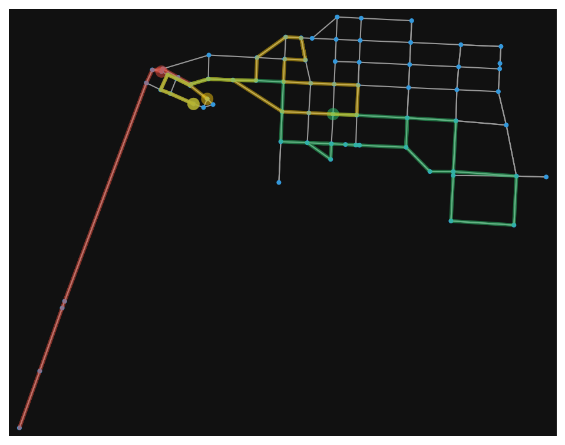
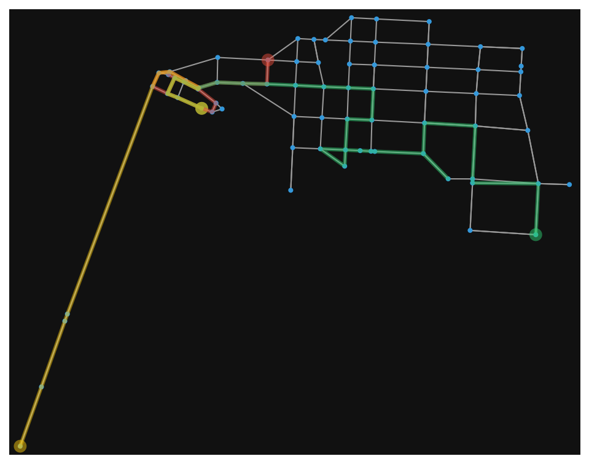
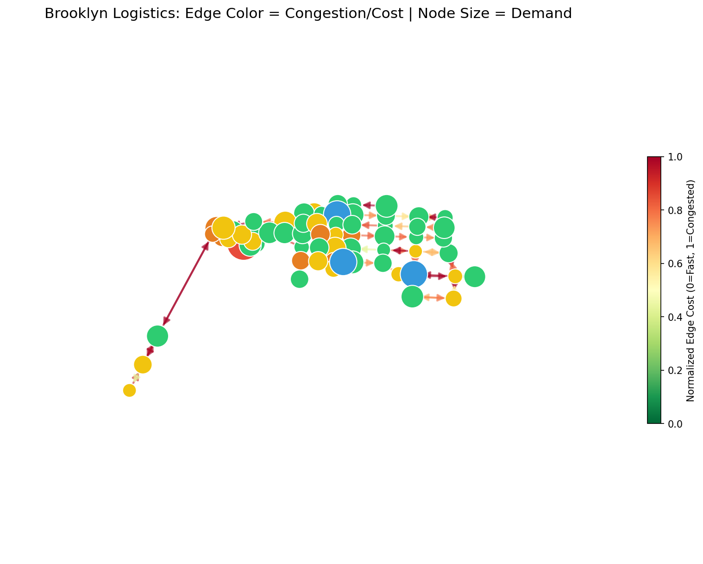

# Logistics Router: Fleet Delivery Route Optimizer
Last-mile delivery route optimization on a real street network (OSMnx/Brooklyn) with traffic simulation, multi-vehicle fleet dispatch, and a head-to-head comparison of greedy and OR-Tools routing strategies.



---
## 1. Purpose

A tool for optimizing delivery routes in urban environments by simulating real-world traffic conditions.

Many routing demonstrations rely on synthetic grids or toy graphs, which understate the irregularity of real street networks and the variability of urban traffic. This project builds a fleet dispatch system on an actual street network pulled from OpenStreetMap (a subgraph of Brooklyn, NY). Delivery stops are assigned by urgency, routed per vehicle under capacity constraints, and compared across two fundamentally different routing strateges - a greedy heuristic that acts as a baseline and an OR-Tools constraint solver.

## 2. How It Works

* **Network**: SpatialDataMapper downloads a subgraph of Brooklyn's street network via OSMnx, centered on a configurable point (currently DUMBO,NYC , chosen for its irregular street layout rather than a numbered grid - a more representative test of the routing logic than a rectilinear sample would provide).

* **Node roles**: Once the graph is built, `LogisticsNetwork.assign_roles()` designates one warehouse, three hubs, and the remaining nodes as customers. Customer nodes are assigned an urgency level (0/1/2, weighted 60/30/10) and a demand value between 5 and 25 units.

* **Edge cost**: Routing uses a composite cost function rather than raw travel time: `0.7 × normalized_travel_time + 0.3 × normalized_distance`. Time dominates route selection, while distance is retained as a secondary factor (fuel cost etc.). Weights are configurable in `normalize_edge_attributes()`.

* **Traffic**: `simulate_traffic(intensity)` perturbs edge weights using Gaussian noise, with higher variance applied to lower-capacity roads and lower variance on arterials, approximating the greater unpredictability of local-road congestion relative to main roads. The simulation is seeded for reproducibility.

* **Dispatch**: Two strategies are implemented with a common interface (`solve(hub_node, customer_nodes, vehicle_count, capacity, net_graph, demands) -> FleetSolution`), so they can be swapped or benchmarked without touching the calling code:

   * `GreedySolver` clusters customers geographically with KMeans (one cluster per vehicle), then routes each vehicle independently via nearest-neighbor traversal. Assignment and routing are thus decided in two separate stages.

   * `ORSolver` solves assignment and routing jointly using Google OR-Tools' constraint solver - a construction heuristic (`PATH_CHEAPEST_ARC`) builds an initial solution, then guided local search improves it within a time budget.

## 3. Current Capabilities:

* Real street network ingestion via OSMnx, cached locally after initial download.
* Two interchangeable routing strategies (GreedySolver, ORSolver) behind a shared RoutingSolver interface.
* Warehouse/hub/customer node hierarchy with urgency and demand attributes.
* Configurable composite edge cost function (time and distance).
* Street-accurate route visualizations using actual latitude/longitude geometry.
* A basic test suite validating both solvers against a synthetic fixture.

## 4. Project Structure

```
logistics-router/
├── main.py                     # entry point - runs and benchmarks both solvers
├── src/
│   ├── network/
│   │   ├── spatial_data_mapper.py  # OSMnx download and subgraph sampling
│   │   └── network_generator.py    # LogisticsNetwork: roles, costs, traffic, visualization
│   ├── solvers/
│   │   ├── routing_solver.py       # RoutingSolver abstract interface
│   │   ├── solution.py            
│   │   ├── greedy_solver.py        # GreedySolver: KMeans + nearest-neighbor implementation
│   │   └── or_solver.py            # ORSolver: OR-Tools constraint solver
│   ├── vehicles/
│   │   └── vehicle_router.py       # Vehicle state object
│   └── logger.py
├── tests/
│   └── test_solvers_smoke.py   # synthetic-graph validation for both solvers
├── poc/
│   └── network_definition.py   # poc for hub-and-spoke topology
├── results/                    # generated visualizations
├── data/                       # cached network JSON (gitignored)
└── requirements.txt
```

## 5. Setup and Usage

1. Install the required libraries:
   ```
   pip install -r requirements.txt
   ```

2. Run the main program:
   ```
   python main.py
   ```

The first run downloads and caches the street network to data/brooklyn_net.json; subsequent runs load from cache. Delete this file to regenerate the network from source.

`main.py` runs both solvers on the same stop set and prints a benchmark summary for each. Fleet size and vehicle capacity are configured at the top of the file:

```python
VEHICLE_CAPACITY = 150
VEHICLE_COUNT = 3
```

## 6. Results

Benchmark run: 
   * 3 vehicles
   * Capacity of 150 units each
   * 28 urgent stops
   * Seeded traffic simulation
   * Identical inputs to both solvers.
 
**Fleet-level comparison:**
 
| Metric | Greedy | OR-Tools |
|---|---|---|
| Vehicles deployed | 3 | 3 |
| Total fleet travel time | 43.6 mins | **34.0 mins** |
| Stops served | 25/28 | **28/28** |
| Stops per vehicle (min–max) | 3–13 | 7–12 |

OR-Tools served all 28 stops - 3 more than `GreedySolver` - while using 22% less total fleet travel time (34.0 vs. 43.6 minutes).

**Per-vehicle breakdown:**
 
| Vehicle | Greedy stops | Greedy time | Greedy load | OR-Tools stops | OR-Tools time | OR-Tools load |
|---|---|---|---|---|---|---|
| V0 | 9 | 10.2 mins | 139.69 | 9 | 12.0 mins | 116.23 |
| V1 | 13 | 19.4 mins | 146.04 | 12 | 15.0 mins | 138.17 |
| V2 | 3 | 14.0 mins | 27.11 | 7 | 7.0 mins | 110.26 |

The `ORSolver` also better balances the number of stops between the 3 vehicles leading to more consistent loads and travel times.

**Greedy routing:**


**OR-Tools routing**, same stops, same fleet: 


**Network topology schematic**, showing node type, urgency, and demand alongside edge congestion cost. Useful for inspecting the underlying data model: 


## 7. Known Limitations:

* **GreedySolvers's capacity handling is simplified.** When a vehicle cannot accommodate the next-nearest stop's demand, that stop is dropped rather than triggering a return-to-hub reload cycle. This is a known contributor to greedy's lower stops-served rate, and is logged and tracked in `vehicle.skipped_nodes`.
* **OR-Tools' search is time-bounded.** The solver runs guided local search for a fixed time limit rather than to full convergence; results may improve marginally with a longer budget.
* **Traffic modeling is approximate.** Gaussian noise on edge weights is a reasonable proxy for congestion variability but does not account for real world factors like traffic signal timing or time-of-day effects.

## 8. Roadmap

* Proper handling of GreedySolver's capacity limitation via a return to hub option.
* Reinforcement learning-based dispatch: a DQN or PPO agent trained via stable-baselines3 to learn a dispatch policy under stochastic demand, using a Gym environment built on the OSMnx graph. To be benchmarked against both existing solvers.
* Time-window constraints (VRPTW)


## License

MIT